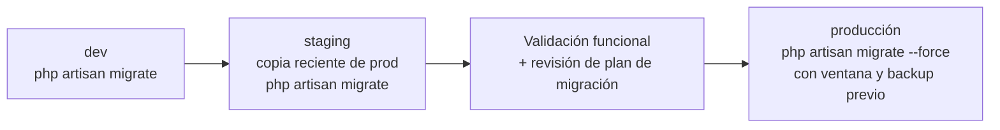
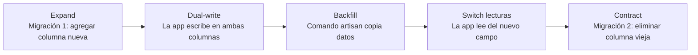

# Evolución del schema — SistemasEscolares

> Reglas para hacer cambios de estructura de base de datos de forma segura sobre el schema MySQL existente en producción.

## Principios básicos

1. **Una migración por cambio**: cada modificación de schema es un archivo nuevo en `database/migrations/`.
2. **Nunca editar migraciones ya aplicadas/pusheadas**: si se necesita corrección, crear otra migración.
3. **Nunca editar `mysql-schema.sql` a mano**: se regenera con `php artisan schema:dump` al consolidar.
4. **Prohibido en producción**: `migrate:fresh`, `migrate:rollback`, `migrate:refresh`.
5. **Siempre `up()` y `down()` simétricas**: para poder revertir en staging antes de ir a prod.

## Flujo por entorno



## Tipos de cambios y procedimiento

### Agregar una columna nueva (seguro)

```php
// database/migrations/2026_04_21_000000_add_campo_a_tabla.php
public function up(): void
{
    Schema::table('tabla', function (Blueprint $table) {
        $table->string('campo_nuevo')->nullable()->after('campo_existente');
    });
}

public function down(): void
{
    Schema::table('tabla', function (Blueprint $table) {
        $table->dropColumn('campo_nuevo');
    });
}
```

### Agregar una tabla nueva (seguro)

```php
public function up(): void
{
    if (! Schema::hasTable('tabla_nueva')) {
        Schema::create('tabla_nueva', function (Blueprint $table) {
            $table->id();
            // ...
        });
    }
}

public function down(): void
{
    Schema::dropIfExists('tabla_nueva');
}
```

### Renombrar una columna (RIESGOSO → patrón expand-contract)



**Migración 1 (Expand)**:
```php
// Agregar nueva columna junto a la vieja
Schema::table('profesores', function (Blueprint $table) {
    $table->string('email_institucional')->nullable()->after('email');
});
```

**Backfill** (comando artisan):
```php
// Copiar datos de email a email_institucional donde aplique
Profesor::whereNull('email_institucional')
    ->update(['email_institucional' => DB::raw('email')]);
```

**Migración 2 (Contract)** — solo cuando ya no hay código que use el campo viejo:
```php
Schema::table('profesores', function (Blueprint $table) {
    $table->dropColumn('email');
});
```

### Cambiar el tipo de una columna (RIESGOSO → patrón expand-contract)

Usar el mismo flujo: nueva columna con nuevo tipo → dual-write → backfill → switch → drop vieja.

Requiere `doctrine/dbal` para `change()`:
```bash
composer require doctrine/dbal
```

### Eliminar una columna (RIESGOSO → patrón expand-contract)

Solo ejecutar el "Contract" después de verificar que ningún código la usa.

## Checklist para PRs que tocan schema legacy

Antes de hacer merge de cualquier PR que incluya migraciones sobre tablas legacy:

- [ ] La migración NO rompe producción si se corre durante tráfico normal (columna nullable o con default)
- [ ] Existe backup previo reciente de producción
- [ ] Se probó contra una copia de producción en staging
- [ ] Hay plan de rollback documentado en la descripción del PR
- [ ] El modelo Eloquent correspondiente está actualizado
- [ ] `docs/modelo-datos.md` está actualizado
- [ ] Tests Pest cubren el cambio
- [ ] `composer check` pasa

## Consolidar migraciones con schema:dump

Cuando hay muchas migraciones acumuladas y se quiere consolidar:

```bash
# Solo en dev/staging con una BD limpia que tenga todas las migraciones aplicadas
php artisan schema:dump --prune

# Esto regenera database/schema/mysql-schema.sql y elimina las migraciones consolidadas
```

**NUNCA en producción**. Solo en dev, y el resultado se versiona en git.
