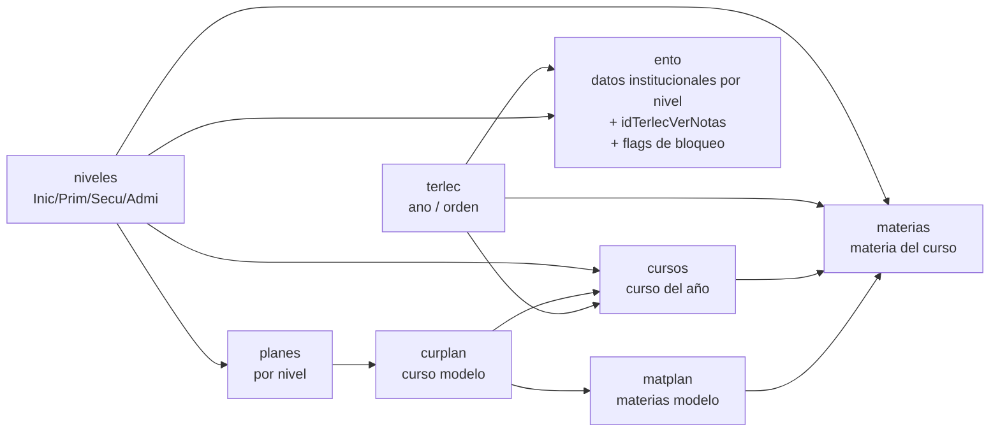
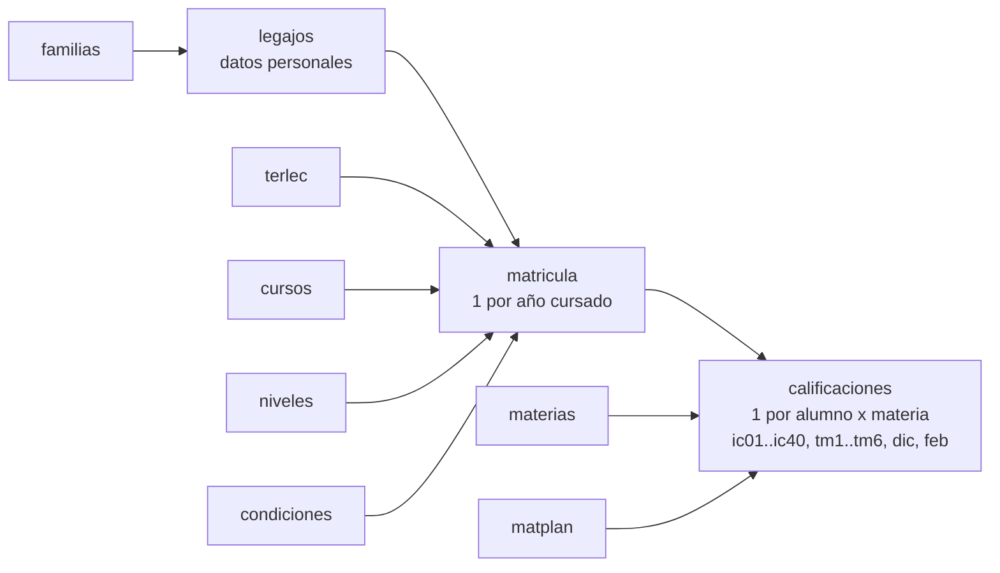

# Modelo de datos — SistemasEscolares

## Cadena de parametrización

## Cadena de alumnos

## Diccionario de tablas del núcleo

### `terlec` — Ciclos lectivos
| Campo | Tipo | Descripción |
|---|---|---|
| `id` | int PK (KEY, no PRIMARY) | Identificador |
| `ano` | int(4) | Año lectivo (ej. 2026) |
| `orden` | int(2) | Orden (1 = activo/actual) |

**Nota**: `terlec` usa `KEY id` sin `PRIMARY KEY` declarado. En Eloquent: `$primaryKey = 'id'`, `public $incrementing = true`.

### `niveles` — Niveles educativos
| Campo | Tipo | Descripción |
|---|---|---|
| `id` | int PK | Identificador |
| `nivel` | varchar(50) | Nombre (Inicial, Primario, Secundario, Terciario, Administración) |
| `abrev` | varchar(5) | Abreviatura |

### `planes` — Planes de estudio
| Campo | Tipo | Descripción |
|---|---|---|
| `id` | int PK | Identificador |
| `idNivel` | int FK→niveles.id | Nivel al que pertenece |
| `plan` | varchar(70) | Nombre del plan |
| `abrev` | varchar(5) | Abreviatura |

### `curplan` — Cursos modelo
| Campo | Tipo | Descripción |
|---|---|---|
| `id` | int PK | Identificador |
| `idPlan` | int FK→planes.id | Plan al que pertenece |
| `curPlanCurso` | varchar(30) | Nombre del curso modelo |

### `matplan` — Materias modelo
| Campo | Tipo | Descripción |
|---|---|---|
| `id` | int PK | Identificador |
| `idCurPlan` | int FK→curplan.id | Curso modelo al que pertenece |
| `matPlanMateria` | varchar(70) | Nombre de la materia |
| `ord` | int(2) | Orden de aparición |
| `abrev` | varchar(5) | Abreviatura |
| `codGE`, `codGE2`, `codGE3` | varchar(15) | Códigos GE |

### `cursos` — Cursos del año
| Campo | Tipo | Descripción |
|---|---|---|
| `Id` | int PK (**mayúscula**) | Identificador |
| `orden` | int(3) | Orden |
| `idCurPlan` | int FK→curplan.id | Curso modelo de origen |
| `idTerlec` | int FK→terlec.id | Ciclo lectivo |
| `idNivel` | int FK→niveles.id | Nivel |
| `cursec` | varchar(30) | Nombre del curso |
| `c` | varchar(1) | División |
| `s` | varchar(1) | Sección |
| `turno` | varchar(20) | Turno |

**Nota crítica**: PK es `Id` con mayúscula. En Eloquent: `protected $primaryKey = 'Id'`.

### `materias` — Materias del curso del año
| Campo | Tipo | Descripción |
|---|---|---|
| `id` | int PK | Identificador |
| `ord` | int | Orden |
| `idCurPlan` | int FK→curplan.id | Curso modelo de origen |
| `idMatPlan` | int FK→matplan.id | **Vínculo crítico con matplan** |
| `idNivel` | int FK→niveles.id | Nivel |
| `idCursos` | int FK→cursos.Id | Curso del año |
| `idTerlec` | int FK→terlec.id | Ciclo lectivo |
| `materia` | varchar(70) | Nombre de la materia |
| `abrev` | varchar(5) | Abreviatura |
| `cierre1e`, `cierre2e` | int(1) | Flags de cierre de etapa |

**REGLA CRÍTICA**: `materias.idMatPlan` NO debe modificarse ni ponerse en 0/NULL una vez creado con vínculo. Ver `070-integridad-curso-materia.mdc`.

### `legajos` — Datos personales de alumnos
~100 columnas organizadas en bloques:
- **Personal**: `apellido`, `nombre`, `dni` (UNIQUE), `fechnaci`, `sexo`, `callenum`, `barrio`, `localidad`, `codpos`, `telefono`, `email`, `idnivel`, `pwrd`
- **Madre**: `nombremad`, `dnimad`, `vivemad`, `fechnacmad`, `emailmad`, `telemad`, ...
- **Padre**: `nombrepad`, `dnipad`, `vivepad`, `fechnacpad`, `emailpad`, `telepad`, ...
- **Tutor**: `nombretut`, `dnitut`, `teletut`, `emailtut`, `ocupactut`, ...
- **Responsable admi**: `respAdmiNom`, `respAdmiDni`
- **Reglamento**: `reglamApenom`, `reglamDni`, `reglamEmail`

### `matricula` — Matrícula anual
| Campo | Tipo | Descripción |
|---|---|---|
| `id` | int PK | Identificador |
| `idTerlec` | int FK→terlec.id | Ciclo lectivo |
| `idNivel` | int FK→niveles.id | Nivel |
| `idCursos` | int FK→cursos.Id | Curso del año |
| `idLegajos` | int FK→legajos.id | Alumno |
| `idCondiciones` | int FK→condiciones.id | Condición (REGULAR, etc.) |
| `nroMatricula` | varchar(10) | Número de matrícula |
| `fechaMatricula` | date | Fecha de matrícula |
| `obsMatr` | varchar(25) | Observación |
| `obsAnual` | text | Observación anual |

### `calificaciones` — Calificaciones por alumno x materia
| Campo | Tipo | Descripción |
|---|---|---|
| `id` | int PK | Identificador |
| `idLegajos` | int FK | Alumno |
| `idMatricula` | int FK | Matrícula |
| `idTerlec` | int FK | Ciclo lectivo |
| `idCursos` | int FK→cursos.Id | Curso del año |
| `idMaterias` | int FK | Materia del año |
| `idMatPlan` | int FK | Materia modelo (para previas) |
| `ord` | int | Orden (copiado de matplan) |
| `ic01..ic40` | varchar(15) | Calificaciones multipropósito |
| `tm1..tm6` | varchar(15) | Trimestres/etapas |
| `dic`, `feb` | varchar(10) | Diciembre/Febrero |

Ver `CalificacionesAdapter` para la semántica por nivel.

### `ento` — Entorno institucional por nivel
| Campo | Tipo | Descripción |
|---|---|---|
| `Id` | int PK (**mayúscula**) | Identificador |
| `idNivel` | int FK→niveles.id | Nivel |
| `idTerlecVerNotas` | int FK→terlec.id | Ciclo de autogestión |
| `idTerlecVerNotas2` | int | Ciclo histórico comparativo |
| `idAspiTerlec` | int FK→terlec.id | Ciclo para aspirantes |
| `insti` | varchar(255) | Nombre institución |
| `cue`, `ee`, `cuit` | varchar | Datos fiscales |
| `direccion`, `localidad`, `departamento`, `provincia` | varchar | Domicilio |
| `telefono`, `mail`, `replegal` | varchar | Contacto |
| `platOff` / `offMensaje` | int/varchar | Plataforma apagada |
| `cargaNotasOff` / `notasOffMensaje` | int/varchar | Carga de notas bloqueada |
| `verNotasOff` / `verOffMensaje` | int/varchar | Ver notas bloqueado |
| `matriculaWebOff` / `mensajeBloqPeda` / `mensajeBloqAdmi` | int/varchar | Matrícula web bloqueada |
| `arancelesOff` | int | Aranceles bloqueados |
| `documAcept1..4` | varchar(150) | PDFs a aceptar |
| `apiDrive`, `siroIniPrim`, `siroSecu`, `siroMje` | varchar | Integraciones externas |
| `environment`, `claveCole` | varchar | Configuración |

### `profesores` — Staff (docentes, directivos, etc.)
| Campo | Tipo | Descripción |
|---|---|---|
| `id` | int PK | Identificador |
| `IdTipoProf` | int FK→profesortipo.id | Tipo/Rol |
| `apellido`, `nombre` | varchar | Nombre |
| `dni` | int(10) UNIQUE | DNI (login) |
| `pwrd` | varchar(10) | Contraseña (plain text o bcrypt) |
| `permisos` | varchar(100) | String de bits 0/1 (posición = `permisosusuarios.orden`) |
| `ult_idTerlec` | int | Último ciclo lectivo accedido |
| `ult_idNivel` | int | Último nivel accedido |

### `permisosusuarios` — Catálogo de permisos
| Campo | Tipo | Descripción |
|---|---|---|
| `id` | int PK | Identificador |
| `orden` | int(4) | Posición en el string `permisos` (0..49) |
| `tema` | varchar(50) | Tema/módulo |
| `descripcion` | text | Descripción del permiso |

## Notas técnicas para Eloquent

- `cursos.Id` y `ento.Id` tienen PK con **mayúscula** → `protected $primaryKey = 'Id'`
- `terlec`, `niveles`, `condiciones` usan `KEY id` sin `PRIMARY KEY` declarado → se mapean normalmente
- Ninguna tabla tiene `created_at`/`updated_at` → `public $timestamps = false` en todos los modelos
- FKs en camelCase: `idTerlec`, `idCursos`, `idLegajos`, `idMatPlan`, etc.
- Collations mezclados: `utf8_unicode_ci`, `utf8_spanish_ci`, `latin1` (no mezclar en queries que comparan strings)
